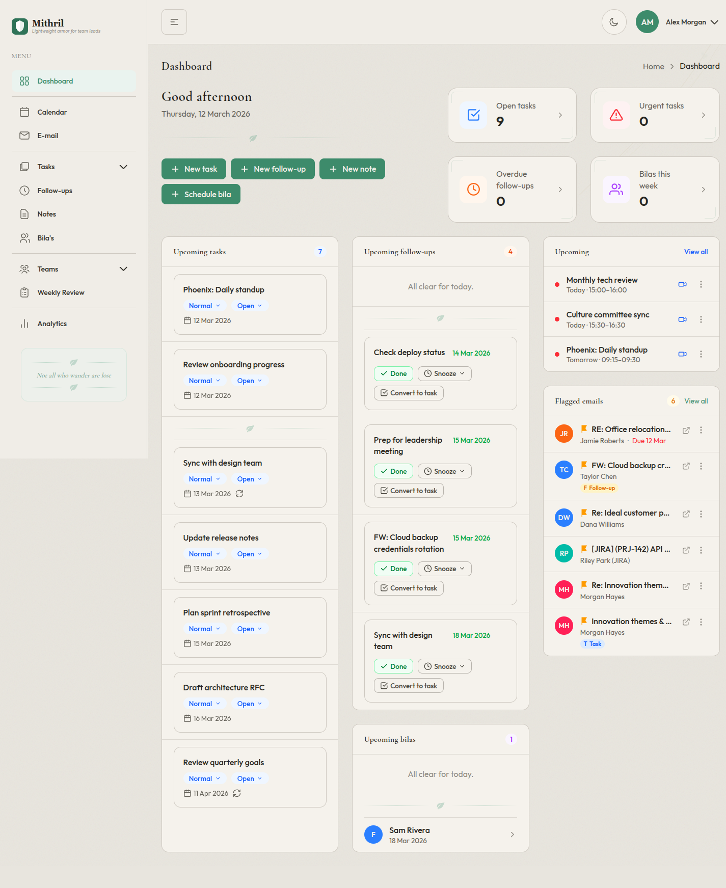
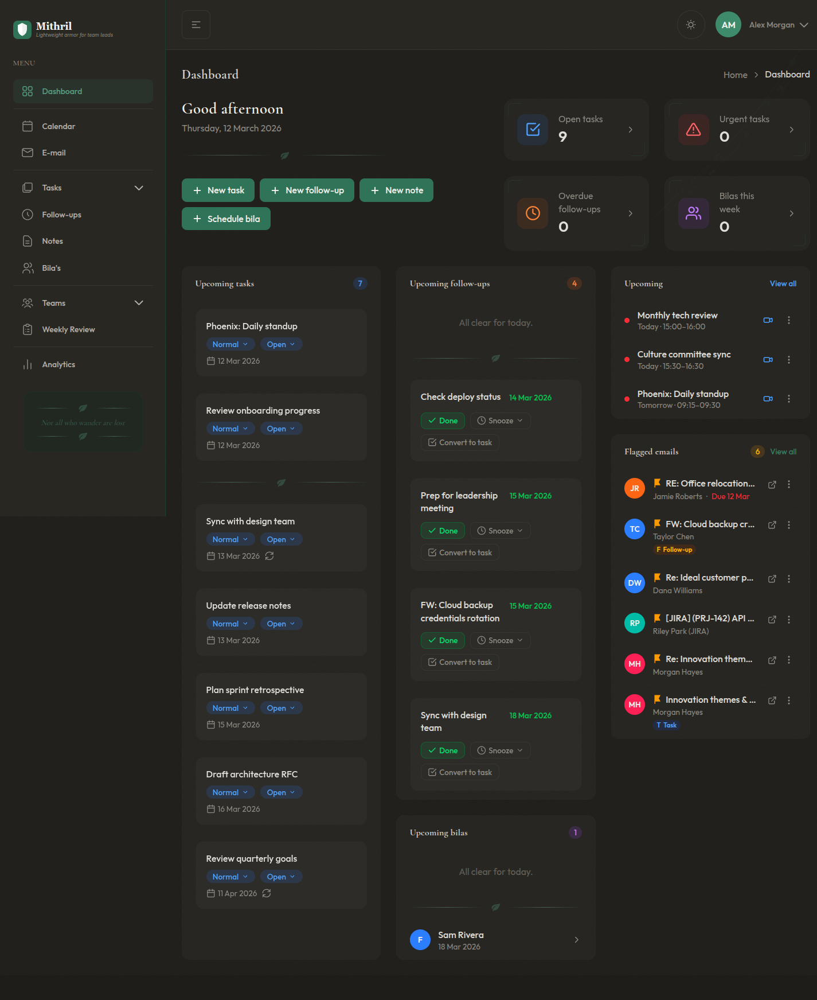
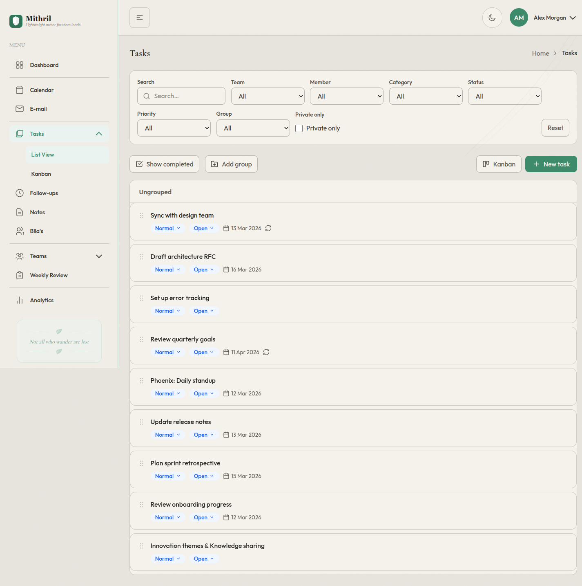
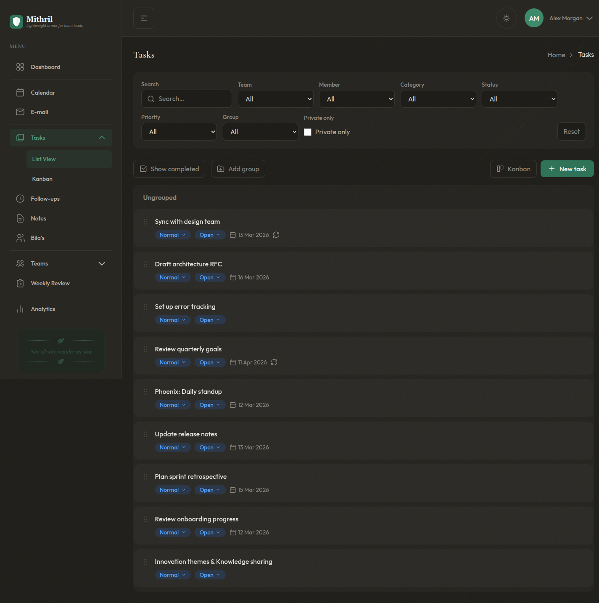
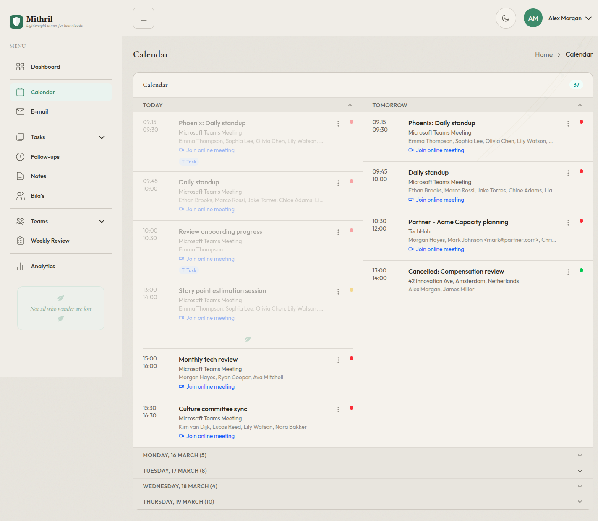
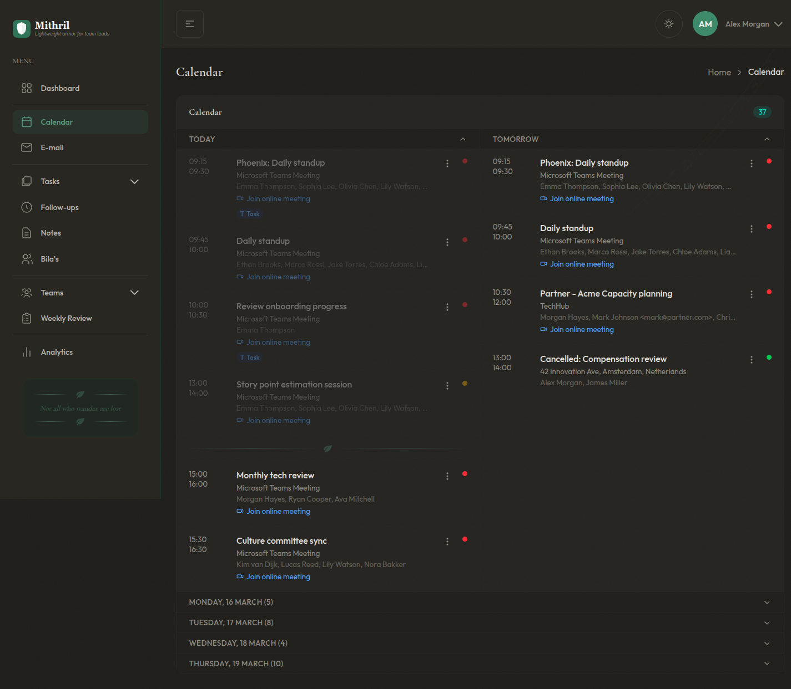

# Mithril

*Lightweight armor for team leads.*

A Progressive Web App (PWA) serving as a personal browser start page for managing teams. Built for technical team leads who need more than basic task lists — with follow-ups, per-member context, and privacy controls.

## Screenshots

### Dashboard

| Light | Dark |
|-------|------|
|  |  |

### Tasks

| Light | Dark |
|-------|------|
|  |  |

### Calendar

| Light | Dark |
|-------|------|
|  |  |

## Features

- **Dashboard** — Greeting, counters, today-section, quick-create buttons, upcoming calendar events, flagged emails
- **Tasks** — Priorities, categories, groups, privacy flag, kanban + list view, drag & drop sorting, bulk actions, recurring tasks
- **Follow-ups** — Timeline view (overdue > today > this week > later), snooze, auto-populated from "waiting" tasks
- **Teams & Members** — Profile pages with linked tasks, follow-ups, bila history, agreements
- **Bilas** — Recurring 1-on-1s with prep items checklist, markdown notes
- **Notes** — Markdown with live preview, tags, pinning, full-text search
- **Weekly Reflection** — Auto-generated summary + free-form reflection
- **Analytics** — Configurable dashboard with charts and widgets
- **Jira Cloud** — Browse assigned/mentioned/watched issues, create resources from issues, dismiss/undismiss, auto-sync
- **E-mail** — Inbox sync from Microsoft 365, flagged email widget, resource linking to tasks/follow-ups/notes/bilas
- **Office 365** — Calendar sync, team member availability, and email integration via Microsoft Graph API
- **PWA** — Service worker, offline fallback, push notifications, installable
- **Auth** — Email/password + remember-me cookie, two-factor authentication (TOTP)
- **Dark mode** — Full dark mode support with Rivendell-inspired UI theme

## Tech Stack

| Layer | Technology |
|-------|-----------|
| Backend | PHP 8.4+ / Laravel 12 |
| Database | MariaDB |
| Frontend | Blade + Alpine.js + Tailwind CSS |
| TypeScript | Strict mode, bundled via Vite |
| Base template | [TailAdmin Laravel](https://github.com/TailAdmin/tailadmin-laravel) (MIT) |
| Libraries | SortableJS, ApexCharts, Flatpickr, Marked |

## Requirements

- PHP 8.4 or higher
- Composer
- Node.js 20+ and npm
- MariaDB 10.6+

## Installation

1. **Clone the repository**

   ```bash
   git clone <repository-url> mithril
   cd mithril
   ```

2. **Install dependencies**

   ```bash
   composer install
   npm install
   ```

3. **Configure environment**

   ```bash
   cp .env.example .env
   php artisan key:generate
   ```

   Edit `.env` and set your database credentials:

   ```dotenv
   DB_CONNECTION=mariadb
   DB_HOST=127.0.0.1
   DB_PORT=3306
   DB_DATABASE=mithril
   DB_USERNAME=root
   DB_PASSWORD=
   ```

4. **Create the database**

   ```bash
   mysql -u root -e "CREATE DATABASE mithril CHARACTER SET utf8mb4 COLLATE utf8mb4_unicode_ci;"
   ```

5. **Run migrations and seed**

   ```bash
   php artisan migrate --seed
   ```

6. **Build frontend assets**

   ```bash
   npm run build
   ```

7. **Configure Microsoft Office 365 integration (optional)**

   To enable calendar sync, team member availability, and email integration from Outlook:

   a. **Create an App Registration** in the [Azure Portal](https://entra.microsoft.com):
      - Go to **Microsoft Entra ID** > **App registrations** > **New registration**
      - Name: `Mithril` (or any name)
      - Supported account types: **Single tenant** (or multi-tenant if your team spans organisations)
      - Redirect URI: **Web** — `https://your-domain.com/auth/microsoft/callback`
      - Click **Register**

   b. **Create a client secret:**
      - Go to **Certificates & secrets** > **New client secret**
      - Copy the **Value** column immediately (it's hidden after you leave the page)
      - Do NOT copy the Secret ID — that's not the secret itself

   c. **Configure API permissions:**
      - Go to **API permissions** > **Add a permission** > **Microsoft Graph** > **Delegated permissions**
      - Add: `User.Read`, `Calendars.Read`, `Mail.Read`, `offline_access`
      - Optionally add `Calendars.Read.Shared` for shared calendar access
      - For team availability without per-member consent: add **Application permission** `Schedule.Read.All` and grant admin consent

   d. **Set environment variables** in `.env`:

      ```dotenv
      MICROSOFT_CLIENT_ID=<Application (client) ID from Overview page>
      MICROSOFT_CLIENT_SECRET=<Secret Value from Certificates & secrets>
      MICROSOFT_TENANT_ID=<Directory (tenant) ID from Overview page>
      MICROSOFT_REDIRECT_URI="${APP_URL}/auth/microsoft/callback"
      ```

   e. **Connect your account** in the app at **Settings** > **Microsoft Office 365** > **Connect Office 365**

   f. **Set up team member availability** (optional):
      - On a member's profile page, fill in their **Microsoft email** address
      - Change **Status source** to **Auto (Office 365)**
      - Their availability status will sync every 5 minutes based on their Outlook calendar

8. **Configure Jira Cloud integration (optional)**

   To enable browsing and linking Jira issues:

   a. **Create an OAuth 2.0 (3LO) app** in the [Atlassian Developer Console](https://developer.atlassian.com/console/myapps/):
      - Click **Create** > **OAuth 2.0 integration**
      - Name: `Mithril` (or any name)
      - Under **Authorization** > **OAuth 2.0 (3LO)**, click **Configure**
      - Callback URL: `https://your-domain.com/auth/jira/callback`
      - Click **Save changes**

   b. **Add API scopes:**
      - Go to **Permissions** > **Jira API** > **Configure**
      - Add scopes: `read:jira-work`, `read:jira-user`
      - The `offline_access` scope is requested automatically for refresh tokens

   c. **Copy credentials:**
      - Go to **Settings** to find your **Client ID** and **Secret**

   d. **Set environment variables** in `.env`:

      ```dotenv
      JIRA_CLIENT_ID=<Client ID from Settings page>
      JIRA_CLIENT_SECRET=<Secret from Settings page>
      JIRA_REDIRECT_URI="${APP_URL}/auth/jira/callback"
      ```

   e. **Connect your account** in the app at **Settings** > **Jira Cloud** > **Connect Jira**

9. **Set up the cron job**

   Laravel's task scheduler needs a single cron entry on your server. This runs scheduled tasks including the daily analytics snapshot, calendar sync (every 5 min), availability sync (every 5 min), email sync, and Jira sync.

   ```bash
   * * * * * cd /path-to-your-project && php artisan schedule:run >> /dev/null 2>&1
   ```

10. **Start a queue worker**

    The calendar, availability, email sync, and Jira sync jobs run on the queue. Start a worker:

    ```bash
    php artisan queue:work --sleep=3 --tries=3
    ```

    For production, use a process manager like Supervisor to keep the worker running. See the [Laravel Queue documentation](https://laravel.com/docs/queues#supervisor-configuration) for a Supervisor config example.

11. **Start the application**

   For development, use the combined dev command that starts the Laravel server, queue worker, log viewer, and Vite dev server simultaneously:

   ```bash
   composer dev
   ```

   Or start services individually:

   ```bash
   php artisan serve        # Laravel dev server
   npm run dev              # Vite dev server
   ```

   The application will be available at `http://localhost:8000`.

## Development

### Key Commands

```bash
composer dev                       # Start all dev services concurrently
php artisan test                   # Run test suite (Pest)
npx tsc --noEmit                   # TypeScript type checking
npm run build                      # Production build
php artisan migrate:fresh --seed   # Reset database with sample data
php artisan schedule:run           # Run scheduler (analytics, calendar sync, availability sync, email sync)
php artisan microsoft:sync-calendars    # Manually sync calendars for all connected users
php artisan microsoft:sync-availability # Manually sync team member availability
php artisan microsoft:detect-members    # Check manual members for O365 mailbox and upgrade
php artisan sync:emails                 # Manually sync emails for all connected users
php artisan jira:sync-issues            # Manually sync Jira issues for all connected users
```

### Verification

Run all three before committing:

```bash
php artisan test
npx tsc --noEmit
npm run build
```

## Architecture

- **No "Save" buttons** — everything auto-saves via debounced AJAX (500 ms)
- **Blade for rendering, Alpine.js for interactivity** — no SPA, no client-side routing
- **Generic controllers** — `ReorderController` and `AutoSaveController` work for any model
- **Reusable model traits** — `HasSortOrder`, `Filterable`, `HasFollowUp`, `Searchable`, `HasResourceLinks`
- **Laravel Events** for side-effects — keeps controllers thin
- **TypeScript modules** exposed as Alpine.js `data()` components

## License

Proprietary. All rights reserved.
