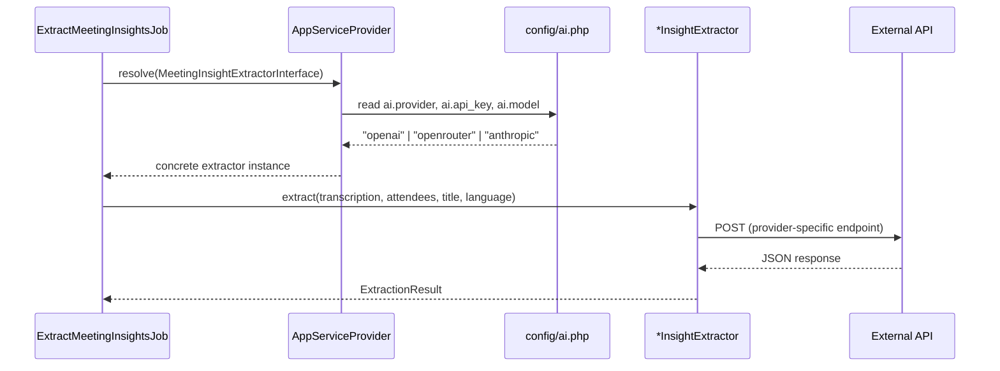

# Multi-Provider AI Extraction (OpenRouter + Anthropic)

**Created:** 2026-03-21
**Status:** Complete
**Author:** Bas de Kort + Claude

## Problem Statement

Meeting insight extraction currently only supports OpenAI via hardcoded config in `config/meetings.php`. Users should be able to choose between OpenAI, OpenRouter, and Anthropic as their AI provider via a global `AI_PROVIDER` + `AI_API_KEY` setting in `.env`, decoupled from meeting-specific services like Whisper and pyannote.

## Acceptance Criteria

1. Global `AI_PROVIDER` env var accepts `openai`, `openrouter`, or `anthropic`
2. Global `AI_API_KEY` and `AI_MODEL` env vars configure the chosen provider
3. AI config lives in a new `config/ai.php` — completely separate from `config/meetings.php`
4. Whisper and pyannote config remain untouched in `config/meetings.php` with their own keys (`OPENAI_API_KEY` for Whisper stays as-is)
5. `config/meetings.php` extraction section references `config('ai.provider')` instead of its own provider key
6. OpenRouter provider uses the OpenAI-compatible API at `https://openrouter.ai/api/v1/chat/completions`
7. Anthropic provider uses the Messages API at `https://api.anthropic.com/v1/messages`
8. All three providers return identical `ExtractionResult` objects
9. Existing tests continue to pass unchanged
10. New providers have unit tests verifying HTTP calls and response parsing
11. Invalid/missing provider config throws a clear error at resolve time

## Technical Design

### Approach

Introduce a global `config/ai.php` that owns provider selection, API key, and model. The meeting extraction system reads from this config instead of its own. Whisper transcription and pyannote diarization keep their own independent config keys — they are not AI chat providers.

The existing `MeetingInsightExtractorInterface` + `OpenAiInsightExtractor` already follows the strategy pattern. We extract shared prompt/parsing logic into an abstract base class, then add two new implementations:

- **OpenRouter** — OpenAI-compatible chat completions format, different base URL
- **Anthropic** — Different API format (Messages API, `x-api-key` header, different request/response structure)

```
MeetingInsightExtractorInterface
    └── AbstractInsightExtractor (prompt building + result parsing)
            ├── OpenAiInsightExtractor (api.openai.com)
            ├── OpenRouterInsightExtractor (openrouter.ai, OpenAI-compatible)
            └── AnthropicInsightExtractor (api.anthropic.com, Messages API)
```

### Config Structure

**New `config/ai.php`:**
```php
return [
    'provider' => env('AI_PROVIDER', 'openai'),  // openai, openrouter, anthropic
    'api_key'  => env('AI_API_KEY'),
    'model'    => env('AI_MODEL', 'gpt-4o-mini'),
];
```

**`config/meetings.php` extraction section (simplified):**
```php
'extraction' => [
    // Provider, key, and model now come from config/ai.php
    // Meeting-specific extraction overrides (if any) go here
],
```

**`.env.example` (AI section):**
```env
# AI Provider (used for meeting extraction and future AI features)
AI_PROVIDER=openai                # Options: openai, openrouter, anthropic
AI_API_KEY=
AI_MODEL=gpt-4o-mini             # OpenAI: gpt-4o-mini, gpt-4o | OpenRouter: openai/gpt-4o-mini | Anthropic: claude-haiku-4-5-20251001
```

Whisper/pyannote env vars (`OPENAI_API_KEY`, `WHISPER_*`, `PYANNOTE_*`) remain unchanged.

### Affected Components

| Component | Action | Description |
|-----------|--------|-------------|
| `config/ai.php` | Create | Global AI provider config (provider, api_key, model) |
| `app/Services/MeetingInsights/AbstractInsightExtractor.php` | Create | Shared prompt building + result parsing extracted from current OpenAI class |
| `app/Services/MeetingInsights/OpenAiInsightExtractor.php` | Modify | Extend abstract base, keep only HTTP call logic |
| `app/Services/MeetingInsights/OpenRouterInsightExtractor.php` | Create | OpenAI-compatible API with OpenRouter URL/headers |
| `app/Services/MeetingInsights/AnthropicInsightExtractor.php` | Create | Anthropic Messages API implementation |
| `config/meetings.php` | Modify | Remove extraction provider/key/model (now in `config/ai.php`) |
| `.env.example` | Modify | Add global AI vars, remove meeting-specific extraction vars |
| `app/Providers/AppServiceProvider.php` | Modify | Read from `config('ai.*')`, match on provider to resolve correct implementation |
| `tests/Unit/Services/MeetingInsights/OpenAiInsightExtractorTest.php` | Create | HTTP-level tests for OpenAI extractor |
| `tests/Unit/Services/MeetingInsights/OpenRouterInsightExtractorTest.php` | Create | HTTP-level tests for OpenRouter extractor |
| `tests/Unit/Services/MeetingInsights/AnthropicInsightExtractorTest.php` | Create | HTTP-level tests for Anthropic extractor |
| `tests/Unit/Providers/AiProviderResolutionTest.php` | Create | Tests that correct class is resolved per config |

### Data Flow



### Edge Cases & Error Handling

- Invalid provider value in config → `InvalidArgumentException` at resolve time
- Missing API key → `RuntimeException` with clear message when `extract()` is called
- Anthropic API returns non-JSON or unexpected structure → same `RuntimeException` pattern as OpenAI
- OpenRouter may return OpenAI-compatible errors → handled by shared error parsing

## Implementation Phases

### Phase 1: Global AI config + extract abstract base class
- **Goal:** Introduce `config/ai.php`, refactor shared logic without changing behavior
- **Specs:**
  - [x] `config/ai.php` exists with `provider`, `api_key`, and `model` keys
  - [x] `config/meetings.php` extraction section no longer contains provider/key/model (only meeting-specific overrides if any)
  - [x] `.env.example` has global `AI_PROVIDER`, `AI_API_KEY`, `AI_MODEL` vars; old `MEETING_EXTRACTION_*` vars removed
  - [x] Whisper and pyannote env vars (`OPENAI_API_KEY`, `WHISPER_*`, `PYANNOTE_*`) remain unchanged
  - [x] `AbstractInsightExtractor` contains `buildSystemPrompt()`, `buildPrompt()`, and `parseResult()`
  - [x] `OpenAiInsightExtractor` extends abstract base and only implements the HTTP call
  - [x] `AppServiceProvider` reads from `config('ai.*')` instead of `config('meetings.extraction.*')`
  - [x] All existing tests pass without modification
- **Files:** `config/ai.php`, `config/meetings.php`, `.env.example`, `AbstractInsightExtractor.php`, `OpenAiInsightExtractor.php`, `AppServiceProvider.php`

### Phase 2: Add OpenRouter provider
- **Goal:** OpenRouter available as AI provider
- **Specs:**
  - [x] `OpenRouterInsightExtractor` sends requests to `https://openrouter.ai/api/v1/chat/completions`
  - [x] Uses `Authorization: Bearer` header with `AI_API_KEY`
  - [x] Sends `HTTP-Referer` and `X-Title` headers
  - [x] `AppServiceProvider` resolves `OpenRouterInsightExtractor` when `AI_PROVIDER=openrouter`
  - [x] Unit tests verify correct URL, headers, and response parsing
- **Files:** `OpenRouterInsightExtractor.php`, `AppServiceProvider.php`, tests

### Phase 3: Add Anthropic provider
- **Goal:** Anthropic available as AI provider
- **Specs:**
  - [x] `AnthropicInsightExtractor` sends requests to `https://api.anthropic.com/v1/messages`
  - [x] Uses `x-api-key` header and `anthropic-version` header
  - [x] Request body uses Anthropic Messages format (`system` as top-level param, `messages` array)
  - [x] Parses Anthropic response format (`content[0].text`) into `ExtractionResult`
  - [x] `AppServiceProvider` resolves `AnthropicInsightExtractor` when `AI_PROVIDER=anthropic`
  - [x] Unit tests verify correct URL, headers, request format, and response parsing
- **Files:** `AnthropicInsightExtractor.php`, `AppServiceProvider.php`, tests

### Phase 4: Provider resolution tests + invalid config handling
- **Goal:** Ensure correct wiring and clear error for bad config
- **Specs:**
  - [x] `AppServiceProvider` throws `InvalidArgumentException` for unknown `AI_PROVIDER` values
  - [x] Integration test: each valid provider string resolves the correct class
  - [x] `.env.example` documents all provider options in comments
- **Files:** `AppServiceProvider.php`, tests

## Out of Scope

- UI for selecting the AI provider (config-only via `.env`)
- Streaming responses
- Fallback/retry across providers
- Cost tracking or token counting
- Using Anthropic/OpenRouter for transcription (Whisper stays independent)
- Per-feature model overrides (single global model for now)

## Resolved Questions

- OpenRouter will send `HTTP-Referer` and `X-Title` headers (recommended by OpenRouter docs for ranking)
- Default Anthropic model: `claude-haiku-4-5-20251001` (Haiku 4.6)
