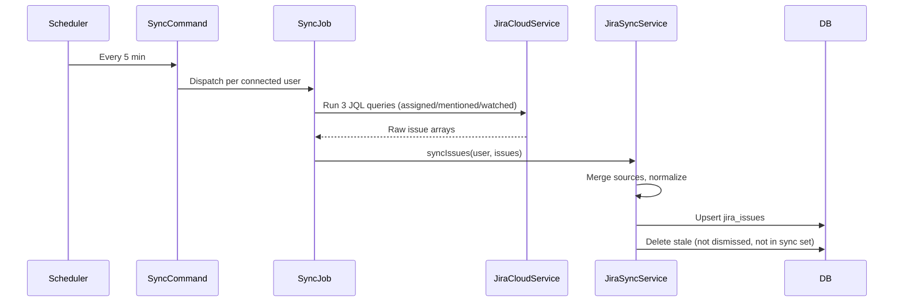
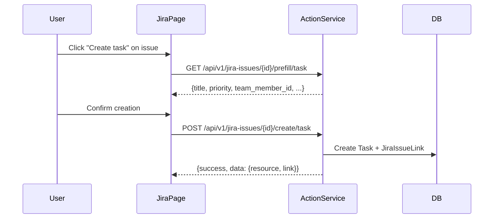

# Jira Cloud Integration

**Created:** 2026-03-12
**Status:** Complete
**Author:** Bas de Kort

## Problem Statement

Team leads often have Jira tickets assigned to them, are mentioned in comments, or watch issues relevant to their team. Currently these live in a separate tool, requiring context-switching. This integration brings Jira issues into Mithril — synced locally, browsable on a dedicated page, shown on the dashboard, and usable as a source for creating tasks, follow-ups, notes, and bilas.

## Acceptance Criteria

1. Users can connect their Atlassian account via OAuth 2.0 (3LO) from the settings page
2. Users can disconnect their Atlassian account, clearing all stored credentials and cached data
3. Jira issues assigned to the user are synced to a local cache table
4. Jira issues where the user is mentioned in comments are synced
5. Jira issues the user is watching are synced
6. Sync runs on a configurable schedule via background jobs (default: every 5 minutes)
7. A dedicated `/jira` page shows all synced issues with filtering and grouping
8. A dashboard widget shows high-priority / recently updated assigned issues
9. Users can create tasks, follow-ups, notes, and bilas from Jira issues (prefill + link pattern)
10. Created resources are linked back to the source Jira issue via a polymorphic pivot table
11. Links can be removed without deleting the resource
12. Stale issues (no longer matching queries) are pruned from the cache
13. Token refresh is automatic and transparent
14. Graceful degradation when Jira is disconnected or tokens are revoked

## Technical Design

### Approach

Mirror the existing Microsoft Office 365 integration architecture:

```
Atlassian OAuth 2.0 (3LO)
        ↓
JiraCloudService (API client, token management)
        ↓
SyncJiraIssuesJob (background, queued)
        ↓
jira_issues table (local cache)
        ↓
JiraActionService (prefill, link, resolve team member)
        ↓
jira_issue_links table (polymorphic pivot)
```

**Jira Cloud REST API v3** is used directly via Laravel's `Http` facade — no SDK dependency, matching the Microsoft Graph pattern.

### Atlassian OAuth 2.0 (3LO) Flow

Atlassian uses a slightly different OAuth flow than Microsoft:

1. Redirect to `https://auth.atlassian.com/authorize` with scopes
2. Callback receives auth code, exchange at `https://auth.atlassian.com/oauth/token`
3. Access token is short-lived (~1 hour), refresh token is long-lived
4. After token exchange, call `https://api.atlassian.com/oauth/token/accessible-resources` to get the Cloud ID (site identifier)
5. API calls go to `https://api.atlassian.com/ex/jira/{cloudId}/rest/api/3/...`

Required scopes: `read:jira-work`, `read:jira-user`, `offline_access`

### Data Sources — JQL Queries

Three separate JQL queries fetch the different issue sources:

| Source | JQL | Label |
|--------|-----|-------|
| Assigned | `assignee = currentUser() ORDER BY updated DESC` | `assigned` |
| Mentioned | `comment ~ currentUser() ORDER BY updated DESC` | `mentioned` |
| Watched | `watcher = currentUser() ORDER BY updated DESC` | `watched` |

Each issue stores which sources it matched (similar to email `sources` field). An issue can match multiple sources.

### Affected Components

| Component | Action | Description |
|-----------|--------|-------------|
| `config/jira.php` | Create | OAuth credentials, scopes, API URLs, sync config |
| `app/Services/JiraCloudService.php` | Create | API client: auth URL, token exchange, refresh, search, get issue |
| `app/DataTransferObjects/JiraTokenResponse.php` | Create | Immutable DTO for OAuth token data |
| `app/Services/JiraSyncService.php` | Create | Sync logic: fetch, normalize, upsert, prune |
| `app/Services/JiraActionService.php` | Create | Prefill, link, resolve team member from issue |
| `app/Models/JiraIssue.php` | Create | Eloquent model with BelongsToUser, scopes |
| `app/Models/JiraIssueLink.php` | Create | Polymorphic pivot model |
| `app/Enums/JiraIssuePriority.php` | Create | Highest/High/Medium/Low/Lowest |
| `app/Enums/JiraIssueStatus.php` | Create | Or store as string — Jira statuses are project-configurable |
| `database/migrations/..._create_jira_issues_table.php` | Create | Cached Jira issues |
| `database/migrations/..._create_jira_issue_links_table.php` | Create | Polymorphic pivot |
| `database/migrations/..._add_jira_columns_to_users_table.php` | Create | OAuth tokens + cloud ID on users |
| `app/Jobs/SyncJiraIssuesJob.php` | Create | Queued job per user |
| `app/Console/Commands/SyncJiraIssues.php` | Create | Artisan command dispatching jobs |
| `app/Http/Controllers/Web/JiraAuthController.php` | Create | OAuth redirect/callback/disconnect |
| `app/Http/Controllers/Web/JiraPageController.php` | Create | Dedicated /jira browse page |
| `app/Http/Controllers/Api/JiraActionController.php` | Create | API: prefill, create, link, unlink |
| `app/Http/Controllers/Api/JiraIssueController.php` | Create | API: list issues for frontend |
| `resources/views/jira/` | Create | Browse page Blade views |
| `resources/views/components/tl/jira-actions.blade.php` | Create | Action menu component |
| `resources/views/components/tl/jira-widget.blade.php` | Create | Dashboard widget |
| `resources/js/components/jira-page.ts` | Create | Alpine component for browse page |
| `resources/js/components/jira-actions.ts` | Create | Alpine component for action menus |
| `routes/web.php` | Modify | Add Jira auth + page routes |
| `routes/api.php` | Modify | Add Jira API routes |
| `routes/console.php` | Modify | Add sync schedule |
| `app/Models/User.php` | Modify | Add Jira token fields, `hasJiraConnection()` |
| `app/Services/DataPruningService.php` | Modify | Add Jira issue + link pruning |
| `app/Helpers/MenuHelper.php` | Modify | Add Jira nav item |
| `resources/views/settings/` | Modify | Add Jira connection section |
| `resources/js/app.ts` | Modify | Register Alpine components |

### Data Model

**`users` table additions:**
```
jira_cloud_id              VARCHAR(255) NULL  -- Atlassian Cloud site ID
jira_account_id            VARCHAR(255) NULL  -- Atlassian account ID
jira_access_token          TEXT NULL (encrypted)
jira_refresh_token         TEXT NULL (encrypted)
jira_token_expires_at      TIMESTAMP NULL
```

**`jira_issues` table:**
```
id                         BIGINT PK AUTO
user_id                    BIGINT FK → users (CASCADE)
jira_issue_id              VARCHAR(255)       -- Jira internal ID
issue_key                  VARCHAR(50)        -- e.g. "PROJ-123"
summary                    VARCHAR(500)
description_preview        TEXT NULL           -- first 500 chars of description
project_key                VARCHAR(50)
project_name               VARCHAR(255)
issue_type                 VARCHAR(100)        -- Bug, Story, Task, Epic, etc.
status_name                VARCHAR(100)        -- Open, In Progress, Done, etc.
status_category            VARCHAR(50)         -- new, indeterminate, done (Jira status categories)
priority_name              VARCHAR(50) NULL    -- Highest, High, Medium, Low, Lowest
assignee_name              VARCHAR(255) NULL
assignee_email             VARCHAR(255) NULL
reporter_name              VARCHAR(255) NULL
reporter_email             VARCHAR(255) NULL
labels                     JSON NULL           -- array of label strings
web_url                    VARCHAR(2048)       -- link to issue in Jira
sources                    JSON                -- ['assigned', 'mentioned', 'watched']
updated_in_jira_at         TIMESTAMP           -- Jira's updated field
is_dismissed               BOOLEAN DEFAULT FALSE
synced_at                  TIMESTAMP
created_at                 TIMESTAMP
updated_at                 TIMESTAMP

UNIQUE (user_id, jira_issue_id)
INDEX  (user_id, status_category)
INDEX  (user_id, is_dismissed, synced_at)
```

**`jira_issue_links` table:**
```
id                         BIGINT PK AUTO
jira_issue_id              BIGINT FK → jira_issues (SET NULL)
issue_key                  VARCHAR(50)        -- denormalized for orphan display
issue_summary              VARCHAR(500) NULL  -- denormalized
linkable_type              VARCHAR(255)
linkable_id                BIGINT
created_at                 TIMESTAMP
updated_at                 TIMESTAMP

UNIQUE (jira_issue_id, linkable_type, linkable_id)
```

### Data Flow





### Edge Cases & Error Handling

1. **Token revoked/expired with no refresh:** Log warning, skip user, show "reconnect" prompt on next visit
2. **Jira site unreachable:** Job retries with backoff (30s, 120s, 300s), max 3 attempts
3. **Issue matches multiple sources:** Merge source arrays, don't duplicate the issue row
4. **Issue no longer matches any query:** Remove from cache (unless dismissed)
5. **Dismissed issue reappears in sync:** Preserve `is_dismissed = true`, update other fields
6. **User has no Jira projects:** Return empty result set, no errors
7. **Team member matching:** Match assignee/reporter email against `TeamMember.email` and `TeamMember.microsoft_email`
8. **Rate limiting:** Jira Cloud has generous limits (basic auth: 100/sec, OAuth: varies). Respect `Retry-After` headers.
9. **Jira status is project-specific:** Store as strings, not enum — group by `status_category` (new/indeterminate/done) for consistent filtering
10. **Cloud ID changes:** Re-fetch accessible resources on token refresh failure

## Implementation Phases

### Phase 1: OAuth & Configuration
- **Goal:** Users can connect/disconnect Jira from settings
- **Specs:**
  - [x] `config/jira.php` contains all required OAuth and API configuration
  - [x] `JiraCloudService` generates correct authorization URL with required scopes
  - [x] `JiraCloudService` exchanges auth code for tokens and fetches cloud ID
  - [x] `JiraCloudService` stores encrypted tokens on the User model
  - [x] `JiraCloudService` refreshes expired tokens automatically before API calls
  - [x] `JiraCloudService` revokes access and clears all Jira columns on disconnect
  - [x] `JiraAuthController` handles redirect, callback (with CSRF state), and disconnect
  - [x] Settings page shows Jira connection status with connect/disconnect button
  - [x] `User::hasJiraConnection()` returns correct boolean
  - [x] Migration adds all required columns to users table
- **Files:** `config/jira.php`, `JiraCloudService`, `JiraTokenResponse`, `JiraAuthController`, User model, migration, settings view

### Phase 2: Data Model & Sync
- **Goal:** Jira issues are synced to a local cache on schedule
- **Specs:**
  - [x] Migration creates `jira_issues` table with all columns and indexes
  - [x] Migration creates `jira_issue_links` table with polymorphic structure
  - [x] `JiraIssue` model uses `BelongsToUser`, has correct casts and fillable
  - [x] `JiraIssueLink` model has `linkable` morphTo relationship
  - [x] `JiraCloudService::searchIssues()` executes JQL and returns normalized results
  - [x] `JiraSyncService` fetches assigned, mentioned, and watched issues (max 250 total, by most recently updated)
  - [x] `JiraSyncService` merges sources when an issue matches multiple queries
  - [x] `JiraSyncService` upserts issues (keyed on `user_id` + `jira_issue_id`)
  - [x] `JiraSyncService` removes stale issues not in sync set (preserving dismissed)
  - [x] `JiraSyncService` preserves `is_dismissed` flag on re-sync
  - [x] `SyncJiraIssuesJob` handles token expiry gracefully (no re-queue on revoked)
  - [x] `SyncJiraIssuesJob` retries up to 3 times with backoff on transient failures
  - [x] `SyncJiraIssues` command dispatches jobs for all Jira-connected users
  - [x] Scheduler runs `jira:sync-issues` every 5 minutes
- **Files:** Migrations, `JiraIssue`, `JiraIssueLink`, `JiraSyncService`, `SyncJiraIssuesJob`, `SyncJiraIssues` command, `routes/console.php`

### Phase 3: Browse Page & Dashboard Widget
- **Goal:** Users can browse synced Jira issues and see a dashboard widget
- **Specs:**
  - [x] `/jira` page renders with all synced issues
  - [x] Issues can be filtered by source (assigned/mentioned/watched/all)
  - [x] Issues can be filtered by status category (open/in progress/done)
  - [x] Issues are grouped by project
  - [x] Each issue card shows: key, summary, status, priority, assignee, project, issue type (text badge), updated date
  - [x] Each issue card has a link to open in Jira (web_url)
  - [x] Issues can be dismissed and un-dismissed
  - [x] Dashboard widget shows assigned issues not in "done" status, ordered by priority + updated date
  - [x] Dashboard widget limit is configurable per user (default: 5)
  - [x] Dashboard widget shows count of total assigned open issues
  - [x] Navigation menu includes Jira link (with icon)
  - [x] Empty state when no Jira connection or no issues
- **Files:** `JiraPageController`, `JiraIssueController` (API), `jira-page.ts`, Blade views, dashboard widget, `MenuHelper`

### Phase 4: Resource Creation & Linking
- **Goal:** Users can create tasks/follow-ups/notes/bilas from Jira issues
- **Specs:**
  - [x] `JiraActionService::resolveTeamMember()` matches assignee/reporter email to TeamMember
  - [x] `JiraActionService::buildPrefillData()` returns correct prefill for each resource type
  - [x] Task prefill: title = summary, maps Jira priority to task priority (Highest→Urgent, High→High, Medium→Medium, Low/Lowest→Low)
  - [x] Follow-up prefill: description = summary, default follow_up_date = 3 days
  - [x] Note prefill: title = issue key + summary, content = description_preview
  - [x] Bila prefill: prep_item_content = summary, requires team member match
  - [x] `JiraActionService::linkResource()` creates `JiraIssueLink` (prevents duplicates)
  - [x] `JiraActionController` API: GET prefill, POST create, DELETE unlink
  - [x] Action menu component shows on each issue card
  - [x] Linked resources shown as badges on issue cards
  - [x] Links can be removed without deleting the resource
  - [x] Creating a bila from a non-team-member issue returns appropriate error
- **Files:** `JiraActionService`, `JiraActionController`, `jira-actions.ts`, `jira-actions.blade.php`, API routes

### Phase 5: Data Pruning & Polish
- **Goal:** Stale data is cleaned up, integration is production-ready
- **Specs:**
  - [x] `DataPruningService` prunes dismissed Jira issues beyond retention period
  - [x] `DataPruningService` prunes orphaned `jira_issue_links`
  - [x] `DataPruningService` prunes stale issues (synced_at > 30 days) as safety net
  - [x] Jira connection status visible on settings page matches actual connection state
  - [x] Disconnecting Jira clears all cached issues and links for the user
  - [x] Factory for `JiraIssue` model exists for testing
  - [x] All existing tests still pass after integration

## Parallelization

**Strategy:** Sequential

All phases have inter-dependencies (OAuth → Models → UI → Actions → Pruning). Phases 3 and 4 share `routes/api.php` and issue card UI, making parallel execution risky for modest gains. Execute all phases sequentially.

## Out of Scope

- **Jira Server / Data Center support** — Cloud only (OAuth 2.0 3LO)
- **Write operations** — no creating/updating Jira issues from Mithril
- **Webhooks** — polling-based sync only; webhooks can be added later if needed
- **Sprint/board views** — issues are shown in a flat list, not a Kanban board
- **Jira comments sync** — only issue metadata is cached, not comment threads
- **Two-way status sync** — completing a task in Mithril doesn't update Jira
- **Multiple Jira sites** — one Cloud site per user
- **Team member Jira email field** — unlike Microsoft, no auto-detection of Jira accounts for team members (can be added later)

## Resolved Questions

1. **Priority mapping:** Direct string mapping at prefill time. Highest→Urgent, High→High, Medium→Medium, Low→Low, Lowest→Low. Jira's original `priority_name` is stored on the cached issue.
2. **Max issues per sync:** 250 issues max across all 3 queries (assigned/mentioned/watched), ordered by most recently updated.
3. **Jira issue type icons:** Text label only — displayed as a badge/pill (e.g. "Bug", "Story"). No external icon URLs.
4. **Dashboard widget limit:** Configurable per user. Default: 5. Stored as a user preference (add `jira_widget_limit` to users table or use a settings JSON column).
