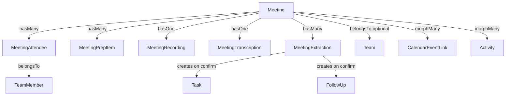
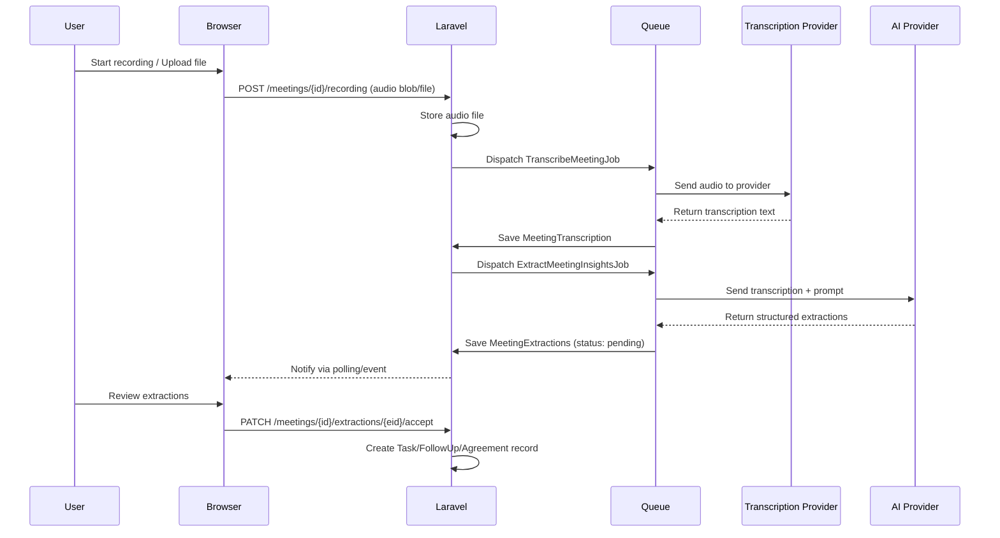

# Meetings — Vergaderingen met opname, transcriptie & AI-extractie

**Created:** 2026-03-18
**Status:** In Progress
**Author:** Bas de Kort

## Problem Statement

Mithril mist een centraal systeem voor vergaderingen. Het huidige Bila-systeem is beperkt tot 1-on-1's met één teamlid. Teamleads hebben behoefte aan een plek om vergaderingen voor te bereiden, live op te nemen, automatisch te laten transcriberen, en via AI taken/follow-ups/samenvattingen te extraheren. Dit vervangt en veralgemeniseert het bestaande Bila-systeem.

## Acceptance Criteria

1. Het Bila-model wordt volledig vervangen door Meeting — bestaande bila-data wordt gemigreerd
2. Een Meeting kan gekoppeld zijn aan een Team, aan meerdere TeamMembers, of aan geen van beide
3. Een Meeting van type `one_on_one` met één attendee is functioneel equivalent aan een voormalige Bila
4. Prep items zijn uitgebreid: type (agendapunt/vraag/actie), tijdsinschatting, toewijzing aan deelnemer
5. Audio kan live in de browser worden opgenomen (MediaRecorder API) of als bestand worden geüpload
6. Audio wordt naar een configureerbare transcriptie-service gestuurd (provider-agnostisch)
7. Uit de transcriptie extraheert een configureerbare AI-service: samenvatting, afspraken, voorgestelde taken, voorgestelde follow-ups
8. Geëxtraheerde items worden ter review aangeboden — gebruiker bevestigt/bewerkt/verwijdert voordat ze als echte records worden aangemaakt
9. Geaccepteerde taken/follow-ups/agreements worden gelinkt aan de bron-meeting (meeting_id FK op Task, FollowUp, Agreement)
10. Alle bestaande Bila-routes, referenties in navigatie, dashboard-widgets en integrations (calendar, email, jira) worden gemigreerd naar Meeting
11. Transcriptietaal is kiesbaar per meeting (NL of EN) — transcriptie volgt de taal van het gesprek
12. Taal van AI-output (taken, samenvatting, afspraken) is instelbaar als gebruikersvoorkeur en per meeting overschrijfbaar
13. `next_bila_date` en `bila_interval_days` op TeamMember worden gemigreerd naar `next_meeting_date` en `meeting_interval_days` (generiek scheduling)
14. Dashboard widget toont zowel upcoming meetings als recent afgeronde meetings met onbeoordeelde extracties
15. Vergaderingen-pagina bevat index (upcoming/past) met filters en detail-pagina met voorbereiding, opname, transcriptie en extracties

## Technical Design

### Approach

Meeting wordt het centrale model dat Bila vervangt en veralgemeniseert. De architectuur volgt bestaande patronen (BelongsToUser, HasActivityFeed, auto-save, etc.) en voegt twee nieuwe asynchrone pipelines toe: transcriptie en AI-extractie, beide via Laravel Jobs met een provider-agnostische service-laag.

### Data Model

#### `meetings` table
| Column | Type | Notes |
|--------|------|-------|
| id | bigint PK | |
| user_id | FK → users | BelongsToUser |
| team_id | FK → teams, nullable | Optionele teamkoppeling |
| title | string | Vergadertitel |
| type | string | Enum: `team`, `one_on_one`, `other` |
| status | string | Enum: `scheduled`, `in_progress`, `completed`, `cancelled` |
| scheduled_at | datetime | Geplande datum/tijd |
| started_at | datetime, nullable | Werkelijke starttijd |
| ended_at | datetime, nullable | Werkelijke eindtijd |
| notes | text, nullable | Vrije notities (markdown, auto-save) |
| summary | text, nullable | AI-gegenereerde samenvatting |
| transcription_language | string(10), default 'nl' | Taal van het gesprek (nl/en) — transcriptie volgt deze taal |
| output_language | string(10), nullable | Taal voor AI-output (taken/samenvatting). Nullable = volgt user preference |
| is_done | boolean, default false | Afgerond-status |
| created_at, updated_at | timestamps | |

#### `meeting_attendees` table (pivot)
| Column | Type | Notes |
|--------|------|-------|
| id | bigint PK | |
| meeting_id | FK → meetings | cascade delete |
| team_member_id | FK → team_members | cascade delete |
| created_at, updated_at | timestamps | |

#### `meeting_prep_items` table
| Column | Type | Notes |
|--------|------|-------|
| id | bigint PK | |
| user_id | FK → users | BelongsToUser |
| meeting_id | FK → meetings | cascade delete |
| team_member_id | FK → team_members, nullable | Toegewezen aan deelnemer |
| content | string(1000) | Inhoud |
| type | string | Enum: `agenda_item`, `question`, `action` |
| duration_minutes | int unsigned, nullable | Geschatte tijd |
| is_discussed | boolean, default false | Besproken-vlag |
| sort_order | int unsigned, default 0 | HasSortOrder |
| created_at, updated_at | timestamps | |

#### `meeting_recordings` table
| Column | Type | Notes |
|--------|------|-------|
| id | bigint PK | |
| user_id | FK → users | BelongsToUser |
| meeting_id | FK → meetings | cascade delete |
| disk | string | Storage disk (local/s3) |
| path | string | Bestandspad |
| original_filename | string, nullable | Originele bestandsnaam (upload) |
| mime_type | string | audio/webm, audio/mp3, etc. |
| size_bytes | bigint unsigned | Bestandsgrootte |
| duration_seconds | int unsigned, nullable | Duur in seconden |
| created_at, updated_at | timestamps | |

#### `meeting_transcriptions` table
| Column | Type | Notes |
|--------|------|-------|
| id | bigint PK | |
| user_id | FK → users | BelongsToUser |
| meeting_id | FK → meetings | cascade delete |
| content | longText | Volledige transcriptie |
| language | string(10) | Overgenomen van meeting.transcription_language |
| provider | string | Service die transcriptie leverde |
| status | string | Enum: `pending`, `processing`, `completed`, `failed` |
| error_message | text, nullable | Foutmelding bij failure |
| created_at, updated_at | timestamps | |

#### Wijzigingen aan bestaande tabellen

**`tasks` table** — toevoegen:
| Column | Type | Notes |
|--------|------|-------|
| meeting_id | FK → meetings, nullable | Link naar bron-meeting (nullOnDelete) |

**`follow_ups` table** — toevoegen:
| Column | Type | Notes |
|--------|------|-------|
| meeting_id | FK → meetings, nullable | Link naar bron-meeting (nullOnDelete) |

**`agreements` table** — toevoegen:
| Column | Type | Notes |
|--------|------|-------|
| meeting_id | FK → meetings, nullable | Link naar bron-meeting (nullOnDelete) |

**`team_members` table** — wijzigen:
| Column | Action | Notes |
|--------|--------|-------|
| next_bila_date | Rename → `next_meeting_date` | Generiek meeting-scheduling |
| bila_interval_days | Rename → `meeting_interval_days` | Generiek meeting-scheduling |

**`users` table** — toevoegen:
| Column | Type | Notes |
|--------|------|-------|
| preferred_output_language | string(10), default 'nl' | Voorkeurstaal voor AI-output (taken/samenvatting) |

#### `meeting_extractions` table
| Column | Type | Notes |
|--------|------|-------|
| id | bigint PK | |
| user_id | FK → users | BelongsToUser |
| meeting_id | FK → meetings | cascade delete |
| type | string | Enum: `task`, `follow_up`, `agreement`, `decision` |
| content | string | Beschrijving van het geëxtraheerde item |
| assignee_id | FK → team_members, nullable | Voorgestelde toewijzing |
| priority | string, nullable | Voorgestelde prioriteit |
| deadline | date, nullable | Voorgestelde deadline |
| status | string | Enum: `pending`, `accepted`, `rejected`, `modified` |
| created_model_type | string, nullable | Polymorph: Task, FollowUp, Agreement |
| created_model_id | bigint, nullable | ID van het aangemaakte record |
| created_at, updated_at | timestamps | |

### New Enums

| Enum | Values |
|------|--------|
| `MeetingType` | `team`, `one_on_one`, `other` |
| `MeetingStatus` | `scheduled`, `in_progress`, `completed`, `cancelled` |
| `PrepItemType` | `agenda_item`, `question`, `action` |
| `TranscriptionStatus` | `pending`, `processing`, `completed`, `failed` |
| `ExtractionType` | `task`, `follow_up`, `agreement`, `decision` |
| `ExtractionStatus` | `pending`, `accepted`, `rejected`, `modified` |

### Service Architecture

#### Provider-agnostische services

- `TranscriptionService` interface met `transcribe(string $audioPath, string $language): string`
- `MeetingInsightExtractor` interface met `extract(string $transcription, array $attendees): array`
- Concrete implementaties via config (`config/meetings.php`):
  - `transcription.provider` → `whisper` (eerste implementatie) | `deepgram` | etc.
  - `extraction.provider` → configureerbaar (eerste implementatie nader te bepalen)
- Laravel service container bindt interface → implementatie op basis van config

### Affected Components

| Component | Action | Description |
|-----------|--------|-------------|
| `app/Models/Meeting.php` | Create | Hoofdmodel, vervangt Bila |
| `app/Models/MeetingAttendee.php` | Create | Pivot voor deelnemers |
| `app/Models/MeetingPrepItem.php` | Create | Uitgebreide prep items |
| `app/Models/MeetingRecording.php` | Create | Audio opname metadata |
| `app/Models/MeetingTranscription.php` | Create | Transcriptie resultaat |
| `app/Models/MeetingExtraction.php` | Create | AI-geëxtraheerde items |
| `app/Enums/Meeting*.php` | Create | 6 nieuwe enums |
| `app/Http/Controllers/Web/MeetingPageController.php` | Create | Vervangt BilaPageController |
| `app/Http/Controllers/Api/MeetingController.php` | Create | API CRUD |
| `app/Services/Transcription/` | Create | Transcriptie service laag |
| `app/Services/MeetingInsights/` | Create | AI extractie service laag |
| `app/Jobs/TranscribeMeetingJob.php` | Create | Async transcriptie |
| `app/Jobs/ExtractMeetingInsightsJob.php` | Create | Async AI extractie |
| `config/meetings.php` | Create | Provider configuratie |
| `resources/views/pages/meetings/` | Create | Index + show views |
| `resources/views/components/tl/meeting-*.blade.php` | Create | Meeting-specifieke componenten |
| `resources/js/components/audioRecorder.ts` | Create | Browser recording Alpine component |
| `resources/js/components/extractionReview.ts` | Create | Review UI Alpine component |
| `database/migrations/*_create_meetings_tables.php` | Create | Nieuwe tabellen |
| `database/migrations/*_migrate_bilas_to_meetings.php` | Create | Data migratie |
| `database/migrations/*_drop_bila_tables.php` | Create | Cleanup |
| `app/Models/Bila.php` | Delete | Vervangen door Meeting |
| `app/Models/BilaPrepItem.php` | Delete | Vervangen door MeetingPrepItem |
| `app/Http/Controllers/Web/BilaPageController.php` | Delete | Vervangen door MeetingPageController |
| `app/Http/Controllers/Api/BilaController.php` | Delete | Vervangen door MeetingController |
| `routes/web.php` | Modify | Bila routes → Meeting routes |
| `routes/api.php` | Modify | Bila API routes → Meeting API routes |
| `app/Http/Controllers/Api/AutoSaveController.php` | Modify | modelMap: bila → meeting |
| `app/Http/Controllers/Api/ReorderController.php` | Modify | modelMap: bila_prep_item → meeting_prep_item |
| `app/Http/Controllers/Api/ActivityController.php` | Modify | modelMap: bilas → meetings |
| `app/Http/Controllers/Web/PartialController.php` | Modify | modelMap: bilas → meetings |
| `app/Helpers/MenuHelper.php` | Modify | Navigatie-item bijwerken |
| `resources/js/app.ts` | Modify | Registreer nieuwe Alpine components |
| `app/Models/TeamMember.php` | Modify | bilas() → meetings() relatie |
| `app/Events/BilaScheduled.php` | Modify/Rename | → MeetingScheduled |
| Alle Blade views met bila-referenties | Modify | Verwijzingen bijwerken |

### Edge Cases & Error Handling

1. **Transcriptie faalt** — status wordt `failed`, error_message opgeslagen, gebruiker kan retry triggeren
2. **AI extractie faalt** — meeting blijft bruikbaar zonder extracties, retry mogelijk
3. **Opname stopt onverwacht** (browser crash) — partial audio wordt bewaard, kan alsnog getranscribeerd worden
4. **Grote audiobestanden** — geen harde limiet, chunked upload voor browser recording
5. **Geen microfoon toegang** — graceful degradation, upload-optie blijft beschikbaar
6. **Bila's zonder teamlid** — kan niet voorkomen (verplicht veld), maar migratie-check toevoegen
7. **Concurrent access** — meeting status transitions via atomic updates
8. **Lege transcriptie** — skip AI extractie, toon melding aan gebruiker
9. **Meerdere recordings per meeting** — data model ondersteunt dit (hasMany), maar UI begint met één
10. **Provider configuratie ontbreekt** — recording/upload werkt, transcriptie/extractie knoppen disabled met config-melding
11. **Audio verwijderd vóór transcriptie** — UI waarschuwt dat transcriptie niet meer mogelijk is na verwijdering; confirm dialog vereist
12. **Audio verwijderd na transcriptie** — geen impact, transcriptie blijft bewaard als tekst

## Implementation Phases

### Phase 1: Data model & Bila-migratie
- **Goal:** Meeting model als drop-in vervanging voor Bila, met alle data gemigreerd
- **Specs:**
  - [x] Meeting model met BelongsToUser, HasActivityFeed, HasResourceLinks, Filterable, Searchable traits
  - [x] MeetingAttendee model met meeting_id + team_member_id
  - [x] MeetingPrepItem model met BelongsToUser, HasSortOrder, type/duration_minutes/assignee velden
  - [x] MeetingType, MeetingStatus, PrepItemType enums
  - [x] Migratie: `bilas` → `meetings` tabel (scheduled_date → scheduled_at, team_member_id → attendee record, type=one_on_one)
  - [x] Migratie: `bila_prep_items` → `meeting_prep_items` (type=agenda_item default, bila_id → meeting_id)
  - [x] Migratie: TeamMember `next_bila_date` → `next_meeting_date`, `bila_interval_days` → `meeting_interval_days`
  - [x] Migratie: meeting_id FK toevoegen aan tasks, follow_ups, agreements tabellen
  - [x] Migratie: preferred_output_language toevoegen aan users tabel
  - [x] TeamMember relatie bijgewerkt: `bilas()` → `meetings()` via attendees pivot
  - [x] Bila model, BilaController, BilaPageController verwijderd
  - [x] Alle modelMaps bijgewerkt (AutoSave, Reorder, Activity, Partial controllers)
  - [x] Routes bijgewerkt (web + api), inclusief email/jira/calendar action whereIn clauses
  - [x] BilaScheduled event → MeetingScheduled event
  - [x] Factory + seeder voor Meeting model
  - [x] Alle bestaande Bila-tests herschreven voor Meeting
- **Files:** Models, Enums, Migrations, Controllers, Routes, Factories, Tests

### Phase 2: Meeting CRUD & Views
- **Goal:** Werkende vergaderingen-pagina met index, detail, en uitgebreide prep items
- **Specs:**
  - [x] MeetingPageController met index (upcoming/past, filters op team/member/type/status)
  - [x] Index view met filter bar, create modal (titel, type, datum, team, deelnemers)
  - [x] Show view met secties: info, deelnemers, prep items, notities, activity feed
  - [x] Prep items CRUD met type-selectie (agendapunt/vraag/actie), tijdsinschatting, toewijzing aan deelnemer
  - [x] Prep items sorteerbaar via drag & drop
  - [x] Auto-save op notes, title, scheduled_at velden
  - [x] Meeting status transitions: scheduled → in_progress → completed, of → cancelled
  - [x] Mark done / undo done functionaliteit (consistent met oude Bila)
  - [x] Dashboard widget bijgewerkt: "Bila's" → "Meetings" (upcoming + recent afgerond met onbeoordeelde extracties)
  - [x] Navigatie bijgewerkt in MenuHelper
  - [x] Breadcrumbs voor meeting detail pagina
  - [x] Previous/next meeting navigatie (per attendee voor one_on_one, per team voor team meetings)
- **Files:** MeetingPageController, Blade views, Blade components, MenuHelper, Dashboard partial

### Phase 3: Audio recording & upload
- **Goal:** Audio opnemen in de browser en/of uploaden, opslaan op disk
- **Specs:**
  - [x] MeetingRecording model met BelongsToUser
  - [x] `audioRecorder` Alpine component: start/stop/pause met MediaRecorder API, visuele waveform/timer
  - [x] Browser recording stuurt audio chunks of volledige blob naar server na stop
  - [x] Upload endpoint voor bestaande audiobestanden (mp3, wav, webm, m4a, ogg)
  - [x] Validatie: max bestandsgrootte (configureerbaar), mime type check
  - [x] Audio opgeslagen op configureerbare disk (local default, s3 optioneel)
  - [x] Audio player component in meeting detail view voor terugluisteren
  - [x] Meeting status automatisch → `in_progress` bij start recording
  - [x] Delete recording mogelijkheid (handmatig, niet automatisch — audio is niet meer nodig na succesvolle transcriptie maar wordt niet automatisch verwijderd)
  - [x] UI hint bij delete: "Transcriptie is beschikbaar, audio kan veilig verwijderd worden" (alleen tonen als transcriptie status=completed)
  - [x] Audio bestanden tellen mee voor de bestaande upload limiet (file storage quota)
- **Files:** MeetingRecording model, migration, audioRecorder.ts, upload endpoint, config/meetings.php

### Phase 4: Transcriptie service
- **Goal:** Audio automatisch transcriberen via configureerbare provider
- **Specs:**
  - [x] MeetingTranscription model met BelongsToUser
  - [x] TranscriptionStatus enum
  - [x] `TranscriptionServiceInterface` met `transcribe()` method
  - [x] Minimaal één concrete implementatie (bijv. OpenAI Whisper)
  - [x] `TranscribeMeetingJob` queued job met retry logic
  - [x] Config `meetings.transcription.provider` + provider-specifieke config
  - [x] Service provider binding interface → implementatie
  - [x] Transcriptietaal kiesbaar per meeting (NL/EN), default vanuit meeting.transcription_language
  - [x] Transcriptie automatisch gestart na recording save (configureerbaar)
  - [x] Status polling in frontend (pending → processing → completed/failed)
  - [x] Transcriptie weergave op meeting detail pagina (scrollbaar, doorzoekbaar)
  - [x] Retry knop bij failed transcriptie
  - [x] Handmatige transcriptie-invoer als fallback (textarea)
- **Files:** MeetingTranscription model, migration, Service interface + impl, Job, config

### Phase 5: AI extractie & review
- **Goal:** Uit transcriptie automatisch taken, follow-ups, afspraken en besluiten extraheren met review-flow
- **Specs:**
  - [x] MeetingExtraction model met BelongsToUser
  - [x] ExtractionType, ExtractionStatus enums
  - [x] `MeetingInsightExtractorInterface` met `extract()` method
  - [x] Minimaal één concrete implementatie (configureerbaar)
  - [x] `ExtractMeetingInsightsJob` queued job
  - [x] AI prompt bevat: transcriptie, deelnemerslijst, meeting context
  - [x] AI output-taal volgt meeting.output_language → user.preferred_output_language → 'nl' fallback
  - [x] AI retourneert gestructureerde JSON: summary + extracties met type/content/assignee/priority/deadline
  - [x] Summary wordt opgeslagen op meeting.summary
  - [x] `extractionReview` Alpine component: lijst van voorgestelde items met accept/reject/edit per item
  - [x] Accept creëert daadwerkelijk Task/FollowUp/Agreement record met meeting_id FK (link naar bron-meeting)
  - [x] Bulk accept/reject mogelijk
  - [x] Modified: gebruiker kan content/assignee/priority aanpassen voor accept
  - [x] Re-extract knop (opnieuw AI laten analyseren)
  - [x] Config `meetings.extraction.provider` + provider-specifieke config
- **Files:** MeetingExtraction model, migration, Service interface + impl, Job, extractionReview.ts, config

### Phase 6: Polish & integraties
- **Goal:** Volledige integratie met bestaande systemen en afwerking
- **Specs:**
  - [x] Calendar event linking werkt voor meetings (vervangt bila linking)
  - [x] Email action "create meeting" werkt (vervangt "create bila")
  - [x] Jira action "create meeting" werkt
  - [x] Zoeken in meetings via global search (als die bestaat)
  - [x] Meeting detail toont gekoppelde calendar events
  - [x] Analytics: meetings per week/maand chart data (indien gewenst)
  - [x] Responsive design check op alle meeting views
  - [x] Accessibility: keyboard navigatie recording controls, ARIA labels
  - [x] Cleanup: verwijder alle resterende Bila-referenties uit codebase
- **Files:** Calendar/Email/Jira action controllers, search integration, analytics, cleanup

## Parallelization

**Strategy:** Sequential

All phases have strong inter-dependencies. Each phase builds on the previous:

- **Phase 1** is foundational — all models, migrations, enums, and the Bila→Meeting migration must complete before anything else
- **Phase 2** creates the MeetingPageController and show/index views that **Phase 3** must extend with recording UI
- **Phase 3** creates the MeetingRecording model that **Phase 4** depends on for transcription input
- **Phase 4** creates MeetingTranscription that **Phase 5** uses for AI extraction
- **Phase 6** integrates everything and cleans up

Within Phase 1, there's also tight coupling: models → migrations → factory → seeder → tests all reference each other. The Bila→Meeting data migration must run after the new tables exist.

**Decision:** Execute sequentially with the lead.

## Out of Scope

- **Real-time collaborative editing** van meeting notes (geen WebSocket/presence)
- **Video recording** — alleen audio
- **Speaker diarization** (wie zegt wat) — mogelijk later als transcriptie-provider dit ondersteunt
- **Live transcriptie** tijdens opname — transcriptie start na afloop
- **Recurring meetings** — kan later worden toegevoegd (vergelijkbaar met recurring tasks)
- **Meeting templates** — vaste agenda-templates voor terugkerende vergadertypen
- **Notificaties** naar deelnemers — Mithril is een persoonlijke tool, geen collaboration platform
- **Externe deelnemers** die geen TeamMember zijn

## Resolved Questions

1. **Transcriptie-provider:** OpenAI Whisper API — beste NL-ondersteuning, enterprise-grade (SOC 2, DPA beschikbaar), past in ISO-omgeving. Provider-agnostische interface maakt later switchen eenvoudig.
2. **Audio opslag limiet:** Geen limiet. Data wordt in ISO enterprise context verwerkt.
3. **Transcriptietaal:** Kiesbaar per meeting (NL of EN). Transcriptie volgt de taal van het gesprek.
4. **AI output-taal:** Instelbaar als gebruikersvoorkeur (`users.preferred_output_language`), per meeting overschrijfbaar (`meetings.output_language`). Taken, samenvattingen, afspraken volgen deze taal.
5. **Meeting-linking:** Ja — `meeting_id` FK op Task, FollowUp, Agreement. Geaccepteerde extracties zijn altijd herleidbaar naar de bron-meeting.
6. **Generiek scheduling:** Ja — `next_bila_date` → `next_meeting_date`, `bila_interval_days` → `meeting_interval_days` op TeamMember.
7. **Dashboard widget:** Upcoming meetings + recent afgeronde meetings met onbeoordeelde extracties.

## Open Questions

_Geen op dit moment._
