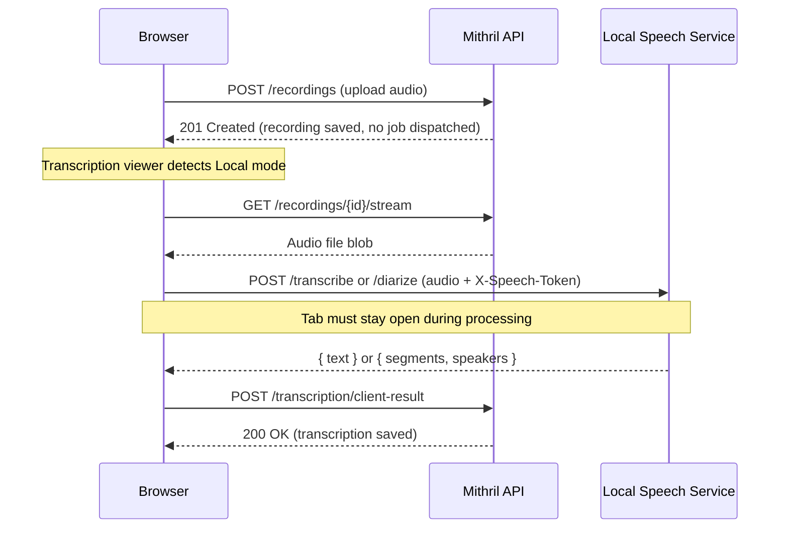

# Per-User Local Speech Service Processing

**Created:** 2026-03-22
**Status:** In Progress
**Author:** Bas de Kort + Claude
**Depends on:** [speech-service-token-auth.md](speech-service-token-auth.md) (must be implemented first)

## Problem Statement

The server deployment may run a CPU-only speech service, resulting in slow transcription. Users with a GPU-equipped local machine can run their own speech service for much faster processing. However, when Mithril is hosted on a remote server, the server cannot reach a user's `localhost` — only the user's browser can. This requires a client-side processing flow where the browser communicates with the local speech service and posts results back to Mithril.

## Acceptance Criteria

1. `SPEECH_CUSTOM_URL_ENABLED` env var (default `false`) controls whether per-user speech service settings are available
2. Users can choose between two processing modes: **Server** (default, queue-based) and **Local** (browser-based)
3. In **Server mode**, transcription/diarization jobs run server-side as they do today
4. In **Local mode**, the browser sends audio to the user's configured speech service URL and posts results back to Mithril's API
5. In Local mode, the browser tab must remain open during processing; the UI clearly communicates this
6. The settings page shows a "Speech Service" section with mode selection, URL/token configuration, and connection test
7. The settings page always shows the system speech service status (health check with device info)
8. Both modes explained clearly in the UI with their trade-offs
9. When `SPEECH_CUSTOM_URL_ENABLED` is true but server-side transcription is disabled, Local mode is still available as the only option
10. All existing tests remain passing; new behavior is covered by tests

## Technical Design

### Approach

Two processing flows:

```mermaid
flowchart TD
    subgraph "Server Mode (default)"
        A1[Recording uploaded] --> B1[Server dispatches queue job]
        B1 --> C1[Queue worker → Speech Service]
        C1 --> D1[Result saved to DB]
        D1 --> E1[Frontend polls for status]
    end

    subgraph "Local Mode (browser-based)"
        A2[Recording uploaded] --> B2[Server stores file, skips job]
        B2 --> C2[Browser fetches audio via stream endpoint]
        C2 --> D2[Browser → localhost Speech Service]
        D2 --> E2[Browser POSTs result to Mithril API]
        E2 --> F2[Result saved to DB]
    end
```

### Processing Modes Explained

**Server mode** (default):
- Works exactly as today: recording uploaded → server dispatches queue job → job calls speech service → result saved
- Speech service URL configured system-wide in `.env` (`UNIFIED_SPEECH_BASE_URL`)
- User has no per-user URL override (the server controls its network reach)

**Local mode** (new):
- Recording is still uploaded to Mithril for storage
- Server does NOT dispatch a transcription/diarization job
- The browser handles speech service communication:
  1. Downloads the recording via the existing stream endpoint
  2. Sends audio to the user's configured URL (e.g., `http://localhost:8090`) with their token
  3. Receives the transcription/diarization result
  4. POSTs the result to a new Mithril API endpoint
- Browser tab must stay open during processing

### Affected Components

| Component | Action | Description |
|-----------|--------|-------------|
| **Enum** | | |
| `app/Enums/SpeechServiceMode.php` | Create | `Server`, `Local` string-backed enum |
| **User Model & Migration** | | |
| `database/migrations/xxxx_add_speech_service_fields_to_users.php` | Create | Add `speech_service_mode`, `speech_service_url`, `speech_service_token` |
| `app/Models/User.php` | Modify | Add fields to `$fillable`, `$hidden`, `$casts` |
| **Configuration** | | |
| `.env.example` | Modify | Add `SPEECH_CUSTOM_URL_ENABLED` |
| `config/meetings.php` | Modify | Add `custom_url_enabled` config key |
| **Recording Controller** | | |
| `app/Http/Controllers/Api/MeetingRecordingController.php` | Modify | Skip job dispatch when user is in Local mode |
| **New API Endpoints** | | |
| `app/Http/Controllers/Api/ClientTranscriptionController.php` | Create | Accept transcription/diarization results from browser |
| `app/Http/Controllers/Api/SpeechServiceHealthController.php` | Create | Proxy server-side health check |
| **Settings** | | |
| `app/Http/Controllers/Web/SettingsController.php` | Modify | Add speech service settings update method |
| `resources/views/pages/settings/index.blade.php` | Modify | Add speech service settings section |
| **Frontend** | | |
| `resources/js/services/local-speech-service.ts` | Create | Browser → local speech service HTTP client |
| `resources/js/components/transcription-viewer.ts` | Modify | Add client-side processing flow |
| **Routes** | | |
| `routes/api.php` | Modify | Add client transcription + health check routes |
| `routes/web.php` | Modify | Add speech service settings route |

### Data Flow — Client-Side Processing

### Edge Cases & Error Handling

- User closes browser tab during Local processing → transcription stays `pending`; user can retry
- User's local speech service unreachable → browser shows clear error, user can retry or switch to Server mode
- CORS: local speech service on `localhost:8090` receives requests from Mithril domain; CORS headers required (handled by token auth plan)
- User switches from Local to Server → existing pending transcriptions can be retranscribed server-side
- `SPEECH_CUSTOM_URL_ENABLED=false` → all users use Server mode, settings section hidden
- `SPEECH_CUSTOM_URL_ENABLED=true` but server-side transcription disabled (`MEETING_TRANSCRIPTION_ENABLED=false` or no system speech service) → Speech Service section still shown; Server mode disabled/hidden, Local mode is the only option and auto-selected
- Local mode without URL configured → validation prevents saving; UI disables save until URL provided
- Large audio files → browser uses streaming fetch where possible

### Settings UI Design

The "Speech Service" section in settings should contain:

1. **System status card** — Always visible. Shows health check result from the system speech service (device: cpu/cuda, model, queue depth). Fetched via server-side proxy.

2. **Mode selector** — Radio buttons:
   - **Server (default)** — "Transcription is processed on the server in the background. You can close your browser after uploading a recording." Only shown when server-side transcription is enabled (`MEETING_TRANSCRIPTION_ENABLED=true` and system speech service configured).
   - **Local (your computer)** — "Transcription is processed by a speech service running on your own computer. This can be much faster if you have a GPU. Your browser tab must remain open during processing."
   - When server-side transcription is disabled, only Local mode is shown (no radio selector needed; just a label explaining why).

3. **Local mode configuration** (shown when Local selected):
   - URL input (placeholder: `http://localhost:8090`)
   - Token input (password field, optional — depends on local service configuration)
   - "Test Connection" button → calls the URL directly from the browser, shows device info on success

## Implementation Phases

### Phase 1: User Model & Mode Configuration
- **Goal:** Database and model support for per-user speech service settings
- **Specs:**
  - [x] `SpeechServiceMode` enum with `Server` and `Local` string-backed values
  - [x] Migration adds nullable columns to `users`: `speech_service_mode` (string), `speech_service_url` (string), `speech_service_token` (string)
  - [x] `User` model: fields in `$fillable`, `speech_service_token` in `$hidden` and cast as `encrypted`
  - [x] `User` model has `isLocalSpeechMode(): bool` method (checks mode AND `custom_url_enabled` config; also returns true if `custom_url_enabled` is true, mode is Local, and server-side transcription is disabled)
  - [x] `config/meetings.php` adds `'custom_url_enabled' => (bool) env('SPEECH_CUSTOM_URL_ENABLED', false)`
  - [x] `.env.example` updated with `SPEECH_CUSTOM_URL_ENABLED=false`
- **Files:** `SpeechServiceMode.php`, migration, `User.php`, `config/meetings.php`, `.env.example`

### Phase 2: Recording Controller — Mode-Aware Dispatch
- **Goal:** Skip server-side job dispatch when user is in Local mode
- **Specs:**
  - [x] `MeetingRecordingController@store` checks `auth()->user()->isLocalSpeechMode()` before dispatching transcription/diarization jobs
  - [x] When Local mode: recording is saved but no job dispatched; response includes `processing_mode: 'local'` flag
  - [x] When Server mode: behavior unchanged (jobs dispatched as before)
  - [x] Existing recording tests updated to cover both modes
- **Files:** `MeetingRecordingController.php`

### Phase 3: Client Transcription API
- **Goal:** Accept transcription/diarization results submitted by the browser
- **Specs:**
  - [x] `POST /api/v1/meetings/{meeting}/transcription/client-result` endpoint
  - [x] Accepts `{ content: string, diarized_content?: object, language: string }`
  - [x] Validates user is in Local mode and `custom_url_enabled` is true (403 otherwise)
  - [x] Creates/updates `MeetingTranscription` with provider `unified`, status `completed`
  - [x] If `diarized_content` provided, sets `diarization_status` to `completed`
  - [x] Returns standard API response
  - [x] Form request validates content is non-empty string, diarized_content structure matches expected schema
- **Files:** `ClientTranscriptionController.php`, `ClientTranscriptionRequest.php`, `routes/api.php`

### Phase 4: Browser Speech Service Client
- **Goal:** TypeScript module for browser → local speech service communication
- **Specs:**
  - [x] `local-speech-service.ts` exports `transcribe(audioBlob, language, url, token): Promise<{ text: string }>`
  - [x] Exports `diarize(audioBlob, language, url, token): Promise<{ segments: DiarizedSegment[], speakers: string[] }>`
  - [x] Exports `health(url, token): Promise<{ ready: boolean, device: string, models: object }>`
  - [x] Sends audio as multipart form data with `X-Speech-Token` header
  - [x] Handles errors with descriptive messages: connection refused, 401 unauthorized, 503 not ready
  - [x] TypeScript strict mode, exported types for all responses
- **Files:** `resources/js/services/local-speech-service.ts`, `resources/js/types/speech-service.ts`

### Phase 5: Transcription Viewer — Local Mode Integration
- **Goal:** Integrate client-side processing into the existing transcription viewer
- **Specs:**
  - [ ] Transcription viewer config receives `speechServiceMode`, `speechServiceUrl`, `speechServiceToken` from controller
  - [ ] When in Local mode and recording is uploaded (via `$dispatch` event or page refresh), viewer starts client-side processing
  - [ ] Flow: fetch audio blob from stream endpoint → call local speech service → POST result to client-result endpoint
  - [ ] UI shows "Processing locally — keep this tab open" indicator with elapsed timer
  - [ ] Retry and retranscribe actions work in Local mode (download recording → reprocess locally → post result)
  - [ ] Error states shown clearly: "Could not connect to your speech service at [url]", "Authentication failed (401)", "Speech service not ready (503)"
  - [ ] When processing completes, normal transcription display takes over (same as server mode)
- **Files:** `transcription-viewer.ts`, `MeetingPageController.php`

### Phase 6: Settings UI & Connection Test
- **Goal:** Users can manage speech service settings and verify connectivity
- **Specs:**
  - [ ] Settings page shows "Speech Service" section when `SPEECH_CUSTOM_URL_ENABLED` is true (regardless of `MEETING_TRANSCRIPTION_ENABLED`)
  - [ ] System status card shown only when server-side transcription is enabled; proxied health check to system speech service URL showing device info (cpu/cuda), model, queue depth
  - [ ] `SpeechServiceHealthController` with `system()` method: proxies health check to system `UNIFIED_SPEECH_BASE_URL`
  - [ ] Mode selector: Server / Local radio buttons with explanation text. When server-side transcription is disabled, Server option is hidden and Local is auto-selected with an explanatory note ("Server-side transcription is not available; configure a local speech service to enable transcription.")
  - [ ] Local mode shows URL input (placeholder `http://localhost:8090`), token input (password), "Test Connection" button
  - [ ] "Test Connection" calls URL directly from browser (not proxied, since it's the user's localhost)
  - [ ] Connection test shows success with device info or failure with error
  - [ ] Auto-saves mode, URL, token via AJAX (debounced)
  - [ ] Validation: Local mode requires non-empty URL
- **Files:** `SettingsController.php`, `SpeechServiceHealthController.php`, `settings/index.blade.php`, `routes/web.php`, `routes/api.php`

## Parallelization

**Strategy:** Partial parallel

### Sequential: Phase 1
Phase 1 (User Model & Config) is the foundation; all other phases depend on it.

### Parallel Group 1: Phases 2, 3, 4, 6
After Phase 1 completes, these can run concurrently:
- **Teammate: backend** — Phase 2 (Recording Controller) + Phase 3 (Client Transcription API)
  - Files: `MeetingRecordingController.php`, `ClientTranscriptionController.php`, `ClientTranscriptionRequest.php`, `routes/api.php`
- **Teammate: typescript** — Phase 4 (Browser Speech Service Client)
  - Files: `resources/js/services/local-speech-service.ts`, `resources/js/types/speech-service.ts`
- **Teammate: frontend** — Phase 6 (Settings UI & Connection Test)
  - Files: `SettingsController.php`, `SpeechServiceHealthController.php`, `settings/index.blade.php`, `routes/web.php`
- **Sync point:** All four phases complete before Phase 5 starts

### Sequential: Phase 5
Phase 5 (Transcription Viewer integration) depends on Phase 3 (client-result API) and Phase 4 (local-speech-service.ts).

## Out of Scope

- Per-user speech model selection
- Per-user diarization engine preference
- Multiple speech service instances per user
- WebSocket/SSE for real-time local processing progress (polling is sufficient)
- Service worker background processing (tab must stay open)
- Offline processing / PWA background sync
- Server mode with per-user URL override (server can only reach what's on its network)

## Open Questions

None — all questions resolved during design.
