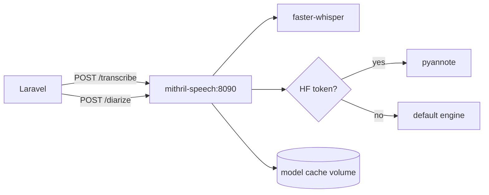
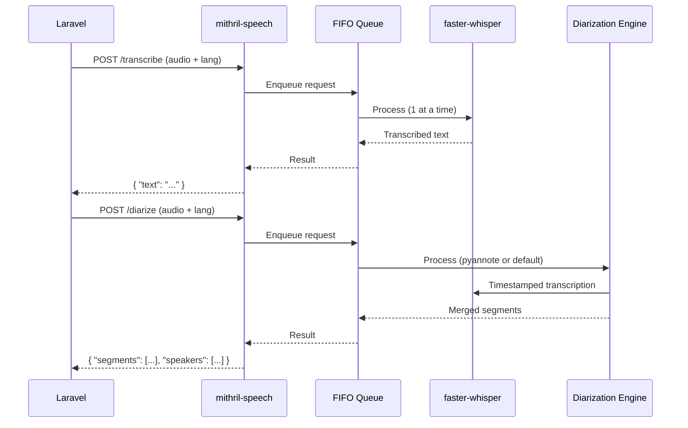

# Unified Speech Processing Service

**Created:** 2026-03-22
**Status:** In Progress
**Author:** Bas de Kort + Claude

## PRD References

| PRD | Title | Status |
|-----|-------|--------|
| [PRD-001-unified-speech-service](prds/PRD-001-unified-speech-service.md) | Unified Speech Processing Service | Approved |

## Problem Statement

Two separate Docker containers (whisper.cpp + pyannote) with redundant model downloads, unreliable GPU profiles, and complex setup. See PRD-001 for full context.

## Acceptance Criteria

Derived from PRD-001 acceptance criteria. Technical additions:

1. PRD AC 1–11, 13–15 — see PRD for details
2. PRD AC 12 — new `UnifiedSpeechService` satisfies both `TranscriptionServiceInterface` and `DiarizationServiceInterface` without interface changes
3. New provider `unified` selectable via `MEETING_TRANSCRIPTION_PROVIDER=unified` and `MEETING_DIARIZATION_PROVIDER=unified`
4. Feature tests verify the Laravel service classes correctly parse responses from the unified service
5. Docker setup includes `docker-compose.yml`, `.env.example`, and a `README.md` with deployment instructions

## Technical Design

### Approach

Build a single Python FastAPI service (`mithril-speech`) that wraps faster-whisper for transcription and provides pluggable diarization (default: open engine, optional: pyannote with HF token). Ship as one Docker image based on `nvidia/cuda:12.x-runtime` that auto-detects GPU at startup.

On the Laravel side, add a single `UnifiedSpeechService` that implements both `TranscriptionServiceInterface` and `DiarizationServiceInterface`, pointing at the same container on different endpoints.

### Affected Components

| Component | Action | Description |
|-----------|--------|-------------|
| `docker/speech/` | Create | New unified service directory (Dockerfile, server.py, requirements.txt, docker-compose.yml, .env.example, README.md) |
| `docker/speech/server.py` | Create | FastAPI app with `/transcribe`, `/diarize`, `/health` endpoints and FIFO queue |
| `docker/speech/Dockerfile` | Create | Single image: nvidia/cuda base, Python 3.11, faster-whisper, optional pyannote |
| `app/Services/Transcription/UnifiedSpeechTranscriptionService.php` | Create | Implements `TranscriptionServiceInterface`, calls `/transcribe` |
| `app/Services/Diarization/UnifiedSpeechDiarizationService.php` | Create | Implements `DiarizationServiceInterface`, calls `/diarize` |
| `config/meetings.php` | Modify | Add `unified` provider option for both transcription and diarization |
| `app/Providers/AppServiceProvider.php` | Modify | Add provider bindings for `unified` |
| `docker/whispercpp/` | Keep (removable) | Marked as legacy — can be deleted after migration |
| `docker/pyannote/` | Keep (removable) | Marked as legacy — can be deleted after migration |

### Data Flow

### Edge Cases & Error Handling

- **No GPU available:** Service starts in CPU mode, logs warning, `/health` reports `device: cpu`
- **Model not cached:** First request waits for download; `/health` reports `ready: false` until loaded
- **HF token invalid:** Pyannote import fails gracefully, falls back to default diarization engine
- **Queue full / long wait:** Service returns queue position and estimated wait; Laravel handles via existing timeout + retry
- **Audio format not supported:** Return 400 with clear error; ffmpeg converts internally where possible
- **Out of memory (large files on CPU):** faster-whisper handles chunking; if OOM, return 500 with descriptive error

## Implementation Phases

### Phase 1: FastAPI Service — Transcription Only
- **Goal:** Working `/transcribe` and `/health` endpoints in a single Docker container
- **PRD criteria:** AC 1, 2, 4, 5, 8, 9, 10, 11, 15
- **Specs:**
  - [x] `POST /transcribe` accepts multipart audio file + `language` param, returns `{ "text": "..." }`
  - [x] `GET /health` returns `{ "ready": bool, "device": "cpu"|"cuda", "models": {...}, "queue_depth": int }`
  - [x] Service detects CUDA GPU automatically at startup, falls back to CPU
  - [x] FIFO queue processes one request at a time; concurrent requests wait in order
  - [x] Models downloaded on first startup, cached in `/models` volume
  - [x] `WHISPER_MODEL` env var selects model size (default: `large-v3-turbo`)
  - [x] Container starts with `docker compose up` on CPU-only host
  - [x] Container starts with `docker compose up` on CUDA-equipped host (same image, GPU via compose override — see ADR-027)
- **Files:** `docker/speech/server.py`, `docker/speech/Dockerfile`, `docker/speech/docker-compose.yml`, `docker/speech/docker-compose.gpu.yml`, `docker/speech/.env.example`, `docker/speech/requirements.txt`

### Phase 2: Diarization — Default Engine
- **Goal:** Working `/diarize` endpoint using a non-gated diarization engine
- **PRD criteria:** AC 3, 6, 9, 11
- **Specs:**
  - [x] `POST /diarize` accepts multipart audio file + `language` param
  - [x] Returns `{ "segments": [{ "speaker": str, "start": float, "end": float, "text": str }], "speakers": [str] }` — same format as current pyannote service
  - [x] Default engine requires no HuggingFace token or gated model access
  - [ ] Default engine + transcription model combined disk < 4GB
  - [x] Diarization requests go through the same FIFO queue as transcription
  - [x] `/health` reports which diarization engine is active
- **Files:** `docker/speech/app/server.py` (extend), `docker/speech/app/requirements.txt` (extend)
- **Note:** Uses `diarize` by FoxNoseTech (ONNX, Apache 2.0, ~10.8% DER). Prototype spike to validate quality on real meeting recordings before finalizing.

### Phase 3: Diarization — Optional Pyannote
- **Goal:** Pyannote as higher-quality diarization option when HF token is provided
- **PRD criteria:** AC 7
- **Specs:**
  - [ ] When `HUGGINGFACE_TOKEN` env var is set, service uses pyannote for diarization
  - [ ] When `HUGGINGFACE_TOKEN` is absent, service uses default engine (Phase 2)
  - [ ] Pyannote models cached in same `/models` volume
  - [ ] `/health` reports `diarization_engine: "pyannote"` or `"default"`
  - [ ] Response format identical regardless of engine
- **Files:** `docker/speech/server.py` (extend), `docker/speech/requirements.txt` (extend)

### Phase 4: Laravel Integration
- **Goal:** New `unified` provider wired into Mithril's service layer
- **PRD criteria:** AC 12, 13
- **Specs:**
  - [ ] `UnifiedSpeechTranscriptionService` implements `TranscriptionServiceInterface` and calls `/transcribe`
  - [ ] `UnifiedSpeechDiarizationService` implements `DiarizationServiceInterface` and calls `/diarize`
  - [ ] `DiarizationResult::fromResponse()` works with unified service response without changes
  - [ ] `config/meetings.php` accepts `unified` as provider for both transcription and diarization
  - [ ] `AppServiceProvider` binds the new services when `unified` is selected
  - [ ] `UNIFIED_SPEECH_BASE_URL` env var defaults to `http://localhost:8090`
  - [ ] Feature tests verify correct response parsing for both endpoints
- **Files:** `app/Services/Transcription/UnifiedSpeechTranscriptionService.php`, `app/Services/Diarization/UnifiedSpeechDiarizationService.php`, `config/meetings.php`, `app/Providers/AppServiceProvider.php`, `tests/`

### Phase 5: Documentation & Cleanup
- **Goal:** Deployment docs and legacy container deprecation
- **PRD criteria:** AC 14
- **Specs:**
  - [ ] `docker/speech/README.md` covers: quick start, env vars, GPU setup, model sizes, production deployment, troubleshooting
  - [ ] `docker/whispercpp/` and `docker/pyannote/` marked as deprecated in their READMEs (not deleted — migration path)
  - [ ] Root `.env.example` updated with unified speech service vars
  - [ ] `docker-compose.yml` (if project-level exists) includes the unified service
- **Files:** `docker/speech/README.md`, `docker/whispercpp/README.md`, `docker/pyannote/README.md`, `.env.example`

## Parallelization

**Strategy:** Partial parallel

### Parallel Group 1: Service + Laravel
- **Teammates:** 2
- **Phases/tasks:**
  - Teammate A (Python): Phases 1, 2, 3 (sequential within)
  - Teammate B (PHP): Phase 4
- **File ownership:**
  - Teammate A: `docker/speech/*`
  - Teammate B: `app/Services/Transcription/UnifiedSpeechTranscriptionService.php`, `app/Services/Diarization/UnifiedSpeechDiarizationService.php`, `config/meetings.php`, `app/Providers/AppServiceProvider.php`, `tests/`
- **Sync point:** Both complete before Phase 5

### Sequential remainder
- Phase 5 (Documentation & Cleanup): runs after parallel group completes because it touches files from both tracks and needs final review

## Out of Scope

- Vulkan GPU support (dropped per PRD)
- Changes to OpenAI Whisper cloud provider (`WhisperTranscriptionService`)
- Changes to AI extraction pipeline or frontend UI
- Multi-GPU or distributed processing
- Speaker identification (name mapping)
- Real-time / streaming transcription
- Removing old Docker directories (user decides when to migrate)

## Open Questions

_None — all questions resolved._

### Resolved

- **Default diarization engine:** `diarize` by FoxNoseTech — ONNX-only, ~10.8% DER, Apache 2.0, no PyTorch needed. Prototype spike in Phase 2 to validate quality on real meeting recordings.
- **Port number:** 8090 confirmed — avoids conflict with existing whisper.cpp (8080) and pyannote (8081) during migration.
- **Queue strategy:** Single shared FIFO queue for both transcription and diarization. Simpler implementation, avoids GPU memory contention from concurrent jobs.
